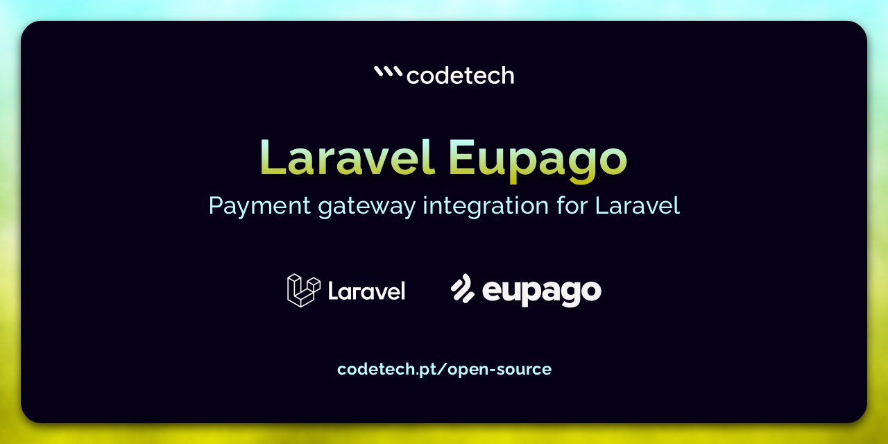

# Laravel EuPago

A Laravel package for making payments through the EuPago API.

[](https://github.com/CodeTechAgency/laravel-eupago/actions/workflows/run-tests.yml)
[](https://github.com/CodeTechAgency/laravel-eupago/releases)
[](https://github.com/CodeTechAgency/laravel-eupago/blob/master/LICENSE)

## Compatibility

| Laravel | Package |
|---------|---------|
| 11      | `v3.1+` |
| 10      | `v2.1+` |
| 9       | `v2.x`  |
| 8       | `v1.x`  |

## Installation

Install the PHP dependency

```
composer require codetech/laravel-eupago
```

Publish the migration

```
php artisan vendor:publish --provider=CodeTech\\EuPago\\Providers\\EuPagoServiceProvider --tag=migrations
```

Run the migration

```
php artisan migrate
```

Publish the configuration file (optional)

```
php artisan vendor:publish --provider=CodeTech\\EuPago\\Providers\\EuPagoServiceProvider --tag=config
```

Publish the translations files (optional)

```
php artisan vendor:publish --provider=CodeTech\\EuPago\\Providers\\EuPagoServiceProvider --tag=translations
```

## Configurations

### Environment

There are two environments available for you to use: "test" and "prod". As you may have guessed,
you can use the "test" environment during the development stage of your application. Switch to "prod"
environment when your application is ready for production.

### Routes

The package supports two levels of usage:

- **Full integration** (default): use the traits and models to persist references, and let the
  package handle EuPago's webhooks — it registers the callback routes (`/eupago/*/callback`)
  automatically.
- **Thin API client**: use only the payment classes (e.g. `new MB(...)->create()`) and handle
  persistence and webhooks yourself.

If you only need the thin client, disable the automatic route registration:

```
EUPAGO_ROUTES=false
```

With the routes disabled you can still mount the package's callback controllers on routes of
your own, giving you full control over the path and middleware:

```
use CodeTech\EuPago\Http\Controllers\MBController;

Route::get('webhooks/eupago/mb', [MBController::class, 'callback'])
    ->middleware('web')
    ->name('eupago.mb.callback');
```

> **Note:** if your application caches routes, run `php artisan route:clear` after changing
> this setting.

### MB References

#### Usage

For creating a MB reference, take the following example:

```
use CodeTech\EuPago\MB\MB;

$order = Order::find(1);

$mb = new MB(
    $order->value,
    $order->id,
    $order->date,
    $order->payment_limit_date,
    $order->value,
    $order->value,
    0 // allows duplicated payments
);

try {
    // Make the request to EUPago's API
    $mbReferenceData = $mb->create();

    if ($mb->hasErrors()) {
        // handle errors
    }
    
    // Make the request to EUPago's API
    $order->mbReferences()->create($mbReferenceData);
} catch (\Exception $e) {
    // handle exception
}
```

`$referenceData` will contain all the information about the payment:

```
[
    'success' => true,
    'state' => 0,
    'response' => "OK",
    'reference' => "000001236",
    'value' => "3.00000",
]
```

Use the trait on the models for which you want to generate MB references:

```

use CodeTech\EuPago\Traits\Mbable;

class Order extends Model
{
    use Mbable;

```

With the trait applied, you can create and persist a reference in a single call. It returns the persisted reference on success, or the errors on failure:

```
$reference = $order->createMbReference($value, $id, $startDate, $endDate, $minValue, $maxValue);
```

Retrieve the MB references:

```
$order = Order::find(1);

$mbReferences = $order->mbReferences;
```

#### Callback

The package already handles the callback, updating the payment reference state and triggering an `MBWayReferencePaid`
event.

```
GET

/eupago/mb/callback
```

#### Params

| Name          |   Type    |
|---------------|:---------:|
| valor         |   float   |
| canal         |  string   |
| referencia    |  string   |
| transacao     |  string   |
| identificador |  integer  |
| mp            |  string   |
| chave_api     |  string   |
| data          | date time |
| entidade      |  string   |
| comissao      |   float   |
| local         |  string   |

### MB Way References

#### Usage

Use the trait on the models for which you want to generate MB Way references:

```

use CodeTech\EuPago\Traits\Mbwayable;

class Order extends Model
{
    use Mbwayable;

```

With the trait applied, you can create and persist a reference in a single call. It returns the persisted reference on success, or the errors on failure:

```
$reference = $order->createMbwayReference($value, $id, $alias);
```

Retrieve the MB Way references:

```
$order = Order::find(1);

$mbwayReferences = $order->mbwayReferences;
```

#### Callback

The package already handles the callback, updating the payment reference state and triggering an `MBWayReferencePaid`
event.

```
GET

/eupago/mbway/callback
```

#### Params

| Name          |   Type    |
|---------------|:---------:|
| valor         |   float   |
| canal         |  string   |
| referencia    |  string   |
| transacao     |  string   |
| identificador |  integer  |
| mp            |  string   |
| chave_api     |  string   |
| data          | date time |
| entidade      |  string   |
| comissao      |   float   |
| local         |  string   |

### PayShop References

#### Usage

For creating a PayShop reference, take the following example:

```
use CodeTech\EuPago\PayShop\PayShop;

$order = Order::find(1);

$payShop = new PayShop(
    $order->value,
    $order->id
);

try {
    // Make the request to EUPago's API
    $payShopReferenceData = $payShop->create();

    if ($payShop->hasErrors()) {
        // handle errors
    }

    $order->payShopReferences()->create($payShopReferenceData);
} catch (\Exception $e) {
    // handle exception
}
```

`$payShopReferenceData` will contain all the information about the payment:

```
[
    'success' => true,
    'state' => 0,
    'response' => "OK",
    'reference' => 1800000132722,
    'value' => "10.00000",
]
```

Use the trait on the models for which you want to generate PayShop references:

```

use CodeTech\EuPago\Traits\PayShopable;

class Order extends Model
{
    use PayShopable;

```

With the trait applied, you can create and persist a reference in a single call. It returns the persisted reference on success, or the errors on failure:

```
$reference = $order->createPayShopReference($value, $id);
```

Retrieve the PayShop references:

```
$order = Order::find(1);

$payShopReferences = $order->payShopReferences;
```

#### Callback

The package already handles the callback, updating the payment reference state and triggering a `PayShopReferencePaid`
event.

```
GET

/eupago/payshop/callback
```

#### Params

| Name          |   Type    |
|---------------|:---------:|
| valor         |   float   |
| canal         |  string   |
| referencia    |  string   |
| transacao     |  string   |
| identificador |  string   |
| mp            |  string   |
| chave_api     |  string   |
| data          | date time |
| entidade      |  string   |
| comissao      |   float   |
| local         |  string   |

### PaysafeCard References

Unlike the reference-based methods above, PaysafeCard is a **redirect flow**: EuPago
returns a payment `url` that you must redirect the customer to, along with a
`reference` for the payment (there is no entity). You also pass your own `id`
(e.g. the order id), which EuPago echoes back in the callback as `identificador`,
and you may optionally pass a `url_retorno` to control where the customer lands
after paying.

#### Usage

For creating a PaysafeCard reference, take the following example:

```
use CodeTech\EuPago\PaysafeCard\PaysafeCard;

$order = Order::find(1);

$paysafeCard = new PaysafeCard(
    $order->value,
    $order->id,
    route('checkout.return') // optional url_retorno
);

try {
    // Make the request to EUPago's API
    $paysafeCardReferenceData = $paysafeCard->create();

    if ($paysafeCard->hasErrors()) {
        // handle errors
    }

    $reference = $order->paysafeCardReferences()->create($paysafeCardReferenceData);

    // Redirect the customer to PaysafeCard to complete the payment
    return redirect()->away($reference->url);
} catch (\Exception $e) {
    // handle exception
}
```

`$paysafeCardReferenceData` will contain the information about the payment:

```
[
    'success' => true,
    'state' => 0,
    'response' => "OK",
    'identifier' => "order-49",
    'reference' => "000017428",
    'url' => "https://clientes.eupago.pt/paysafecard/pay/...",
    'value' => 25.00,
]
```

Use the trait on the models for which you want to generate PaysafeCard references:

```

use CodeTech\EuPago\Traits\HasPaysafeCardReferences;

class Order extends Model
{
    use HasPaysafeCardReferences;

```

With the trait applied, you can create and persist a reference in a single call. It returns the persisted reference (whose `url` you redirect to) on success, or the errors on failure:

```
$reference = $order->createPaysafeCardReference($value, $id, $returnUrl);
```

Retrieve the PaysafeCard references:

```
$order = Order::find(1);

$paysafeCardReferences = $order->paysafeCardReferences;
```

#### Callback

The package already handles the callback, updating the payment reference state and triggering a `PaysafeCardReferencePaid`
event. The pending reference is matched on `referencia`, like the other payment methods.

```
GET

/eupago/paysafecard/callback
```

#### Params

| Name          |   Type    |
|---------------|:---------:|
| valor         |   float   |
| canal         |  string   |
| referencia    |  string   |
| transacao     |  string   |
| identificador |  string   |
| mp            |  string   |
| chave_api     |  string   |
| data          | date time |
| entidade      |  string   |
| comissao      |   float   |
| local         |  string   |

---

## Querying reference status

Besides the callback, you can query a reference's current status on demand — useful
for reconciliation or when a callback is missed or delayed. EuPago resolves any
reference type (MB, MB Way, PayShop) through a single reference-info endpoint, so
the same call works regardless of how the reference was created:

```
use CodeTech\EuPago\EuPago;

$eupago = new EuPago;

try {
    $status = $eupago->status($reference, $entity);

    if ($eupago->hasErrors()) {
        // handle errors
    }
} catch (\Exception $e) {
    // handle exception
}
```

The `$entity` argument is optional. `$status` is mapped to normalized keys, where
`reference_state` holds the payment status (e.g. `"pendente"`, `"pago"`):

```
[
    'success' => true,
    'state' => 0,
    'response' => "OK",
    'entity' => "81921",
    'reference' => "800152011",
    'identifier' => "order-123",
    'reference_state' => "pendente",
    'created_date' => "2026-06-27",
    'created_time' => "00:22:49",
    'archived' => false,
]
```

---

## Testing & code quality

Run the test suite, static analysis, and code-style checks via Composer:

```bash
composer test      # Pest test suite
composer analyse   # PHPStan/Larastan static analysis
composer lint      # Pint code-style check (run `composer format` to fix)
```

## Upgrading

Please see [UPGRADE.md](https://github.com/CodeTechAgency/laravel-eupago/blob/master/UPGRADE.md) for information on how
to upgrade between major versions.

## License

**codetech/laravel-eupago** is open-sourced software licensed under
the [MIT license](https://github.com/CodeTechAgency/laravel-eupago/blob/master/LICENSE).

## About CodeTech

[CodeTech](https://www.codetech.pt) is a web development agency based on Matosinhos, Portugal. Oh, and we LOVE Laravel!
